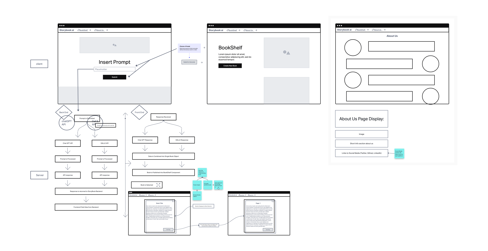

# 301-project-tempname

## Team

- James Ian R. Solima
- Sheldon Pierce
- Ethan Albers
- Reed Vogt

## User Stories

 
 User Stories 

As a user I want to see an easy to navigate website so that I can find out what I need to do and where to go

As a user I want to be able to create books for my child that are customized to a story that they can help create and will love

As a user I want there to be visuals in the stories so that me and my child can have visual stimulation 

As a user I want to be able to edit the books that I created and delete the ones I don't like so that I have a customized bookshelf

As a user I want to be able to only see my books and not let other users see my books so that I can have privacy

## Domain Model

## Cooperation Plan

 
 Coop Plan 

- What are the key strengths of each person on the team?

James: Adaptable, pretty knowledgeable with the basics of MERN, 

Sheldon: Beautifying site, UI/UX, Layout, Chakra UI, Front End, Authentication and Sign up

Reed: Committed to the grind

Ethan: Back End, Express, APIs

- How can you best utilize these strengths in the execution of your project?

We can assign roles of the development process to teammates based on their strengths to divide and conquer this application.

- In which professional competencies do you each want to develop greater strength?

We all want to grow as developers and learn how to implement these new tools in our project, including using openAI's APIs, creating newsletters, creating a beautiful UI

- Knowing that every person in your team needs to understand all aspects of the project, how do you plan to approach the day-to-day work?

We will have daily stand ups, and try to get as much done as possible. We have a trello board with the tasks needed to complete this application and will complete tasks on the board in a timely manner.

 

## Conflict Plan

Conflict Plan

- What will be your group’s process to resolve conflict, when it arises?

Open communication and if problems arise, we will bring it up to the higher ups.

- What will your team do if one person is taking over the project and not letting the other members contribute?

Clearly communicate if we see an issue with someone taking over the project or doing more and not letting others contribute. 

- How will you approach each other and the challenges of the project knowing that it is impossible for all members to be at the exact same place in understanding and skill level?

We will discuss issues and go over code during our daily standups.

- How will you raise concerns to members who are not adequately contributing?

Communicate to them, and if they cannot contribute then try to find a time that they can.

- How and when will you escalate the conflict if your resolution attempts are unsuccessful?

We will contact the instructors if we cannot resolve conflicts.

 

## Communication Plan

 Comms Plan 

- What hours will you be available to communicate?

M-F 9-5pm, Afterhours and weekends usually.

- What platforms will you use to communicate (ie. Slack, phone …)?

We will be using Slack and Remo

- How often will you take breaks?

As often as needed.

- What is your plan if you start to fall behind?

Cut out extra features and code that is not necessary for the app to work.

- How will you communicate after hours and on the weekend?

Through Slack and Remo

- What is your strategy for ensuring everyone’s voice is heard?

We will try to meet in the morning for a daily stand up and discussion.

- How will you ensure that you are creating a safe environment where everyone feels comfortable speaking up?

During daily standups, we will go around the table to see if anyone has any input or discussions.

 

## Work Plan

 Work Plan 

- How you will identify tasks, assign tasks, know when they are complete, and manage work in general?

We will be using a trello board

- What project management tool will be used?

Trello

 

## Git Process

 

- What components of your project will live on GitHub?

The Front and back end

- How will you share the repository with your teammates?

We will all be collaborators on the repo

- What is your Git flow?

branch out to own branches, edit code, ACP, then merge after discussion.

- Will you be using a PR review workflow? If so, consider:

We will merge pull request changes to a features branch before merging into main

- How many people must review a PR?

One other teammate will be fine.

- Who merges PRs?

Reviewer and pusher.

- How often will you merge?

Try to merge at least once every other hour.

- How will you communicate that it’s time to merge?

We will communicate through slack and remo if pair programming

### Credits and Collabs
